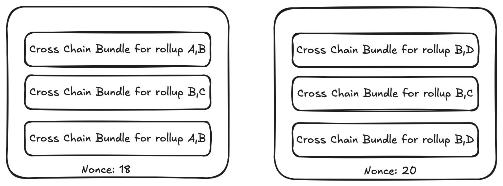
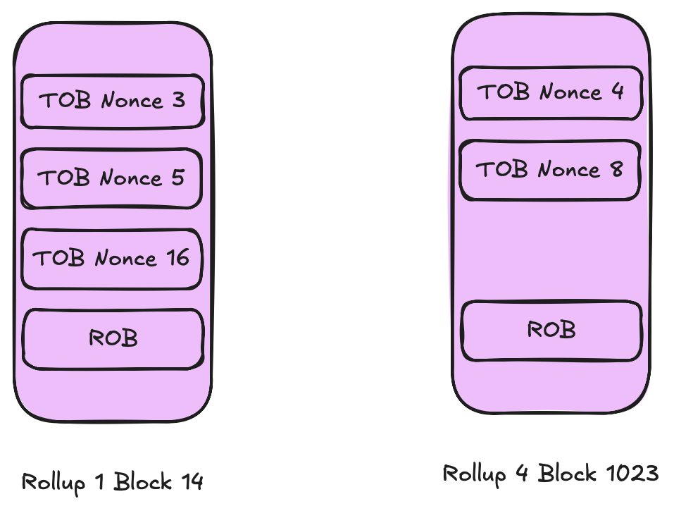
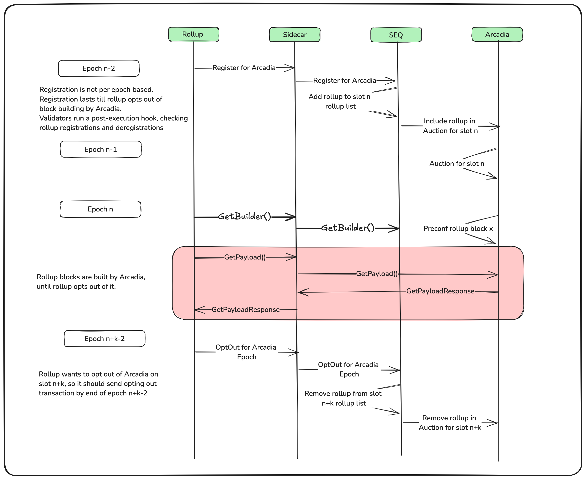

# Arcadia

Arcadia facilitates the Shared Block Production on The Composable Network for participating Rollups. Block Production on Arcadia is divided into 12s(6 SEQ blocks) epochs with a single block builder building blocks for all the participating rollups in that epoch. The winning block builder is selected through an Ahead Of Time Auction on Arcadia. Rollup blocks are built as chunks and preconfed by validators. All txs in preconfed chunks will be included in SEQ blocks later.

## Rollups:
- Rollups opt for shared block production by Arcadia ahead of time from a given epoch and are added to the list of participating rollups for the shared auction.
- Rollups get synchronous atomic composability for the blocks built during the participating epoch.
- Once opt-in for shared block production, rollups continue in the list of participating rollups for future epochs until they entirely opt out or opt out for a specific epoch.
- Rollups opt-in and out entirely through the `RegisterRollup` action tx.
- Rollups opt-out for an epoch through `epochExit` action tx.

## Ahead Of Time Auction:
- Auction for rights to build blocks for participating rollups in epoch K starts one epoch earlier and ends with the production of the 4th block of SEQ in epoch K-1.
- Rollups can Opt In or Out for epoch K before the end of epoch K-2. The list of participating rollups for epoch K finalises with the end of epoch K-2, and builders bid for rights to build blocks for all participating rollups based on the perceived value accrual for epoch K and private order flow deals.
- With the 4th block of SEQ in epoch k-1 produced, the winning bid is sent to be included in the next SEQ block as an `Auction` action tx to deduct the bid amount from the builder.
- All participating entities are notified about the bid winner once the `Auction` action tx is made through a SEQ block.

## Chunks:
- In Arcadia, txs are preconfed as chunks rather than blocks. 
- There are two defined chunk types: i. Top Of Block(ToB) ii. Rest Of Block(RoB). A chunk consists of a set of txs or tx bundles, depending on whether it is a ToB or RoB.
- SEQ supports a single rollup tx or cross-chain bundle in a single tx as multi-action tx is supported.
- A ToB contains cross-rollup bundles only. However, a ToB does not necessarily need to contain txs for all participating rollups, but it can contain any subset of the list. A RoB contains txs for a single rollup.
- Chunks get preconfed by validators and made available for rollups to pull.
- A Rollup block can have multiple ToB chunks but only one RoB chunk. 

## Block Builders:
- Block builders participate in the auction after confirming their ability to build blocks for participating rollups.
- They build ToB chunks for different subsets of participating rollups and RoB chunks for each rollup. They continuously send them with rollup block numbers and chunk nonce to Arcadia to get them preconfed by SEQ validators.
- Every rollup block, ideally, contains many ToBs and one RoB. ToBs are ordered by the chunk nonce included, along with the chunk followed by RoB.
  
ToB chunks contain different subsets of rollups:

    

A rollup block built by the builder:

  

## SEQ Validators:
- SEQ validators register with Arcadia to receive chunks for preconfing.
- Validators make a few assertions on chunks and issues chunk certificate if all assertions are satisfied. 
- Validators store the signature verified txs in an emap to prevent duplicate txs and ease signature verification while accepting the block.
- SEQ blocks are produced every 2 seconds. Validators fetch the `SequencerMsg` txs payload from Arcadia to get included in the SEQ block and fill the rest of the block with `non SequencerMsg` txs.

## E2E Flow:

