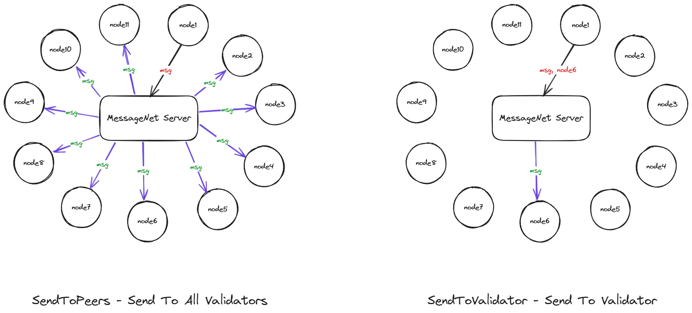
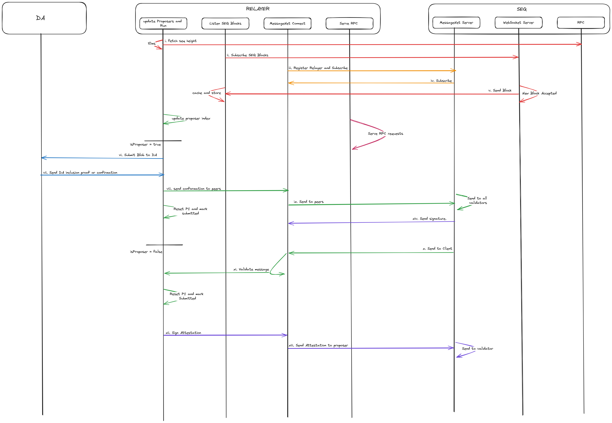

# MessageNet Server:

MessageNet Server is an important part of the SEQ Messaging layer or SEQ P2P layer. MessageNet allows relayer(s) to communicate with relayer(s) of other validators and pass arbitrary messages, useful for relay confirmation, slashing, or attestations.



## Overview:

### Functions:

- **registerRelayer**: Register(s) a new relayer(s) and starts a websocket connection for listening from the relayer(s) and executes relavent actions based on first byte of `data` sent by relayer. 

- **SendToValidator**: Send arbitary data to a validator.

```go

type SendToValidatorsData struct {
	RelayerID int        `json:"relayer_id"`
	NodeID    ids.NodeID `json:"node_id"`
	RawData   []byte     `json:"raw_data"`
}
```

- **SendToPeers**: Send arbitary data to all validators.

```go

type SendToPeersData struct {
	RelayerID int    `json:"relayer_id"`
	RawData   []byte `json:"raw_data"`
}
```

- **SignAndSendToValidator**: Sign data and send signed message to a validator. 

```go 

type SignAndSendToValidatorData struct {
	RelayerID          int        `json:"relayer_id"`
	NodeID             ids.NodeID `json:"node_id"`
	IdentificationByte byte       `json:"identification_byte"`
	MsgBytes           []byte     `json:"msg_bytes"`
}
```

- **SignAndSendToPeers**: Sign data and send signed message to all validators.

```go 

type SignAndSendToPeersData struct {
	RelayerID          int    `json:"relayer_id"`
	IdentificationByte byte   `json:"identification_byte"`
	MsgBytes           []byte `json:"msg_bytes"`
}
```

- **SendToClient**: Sends all messages received by the validator to the corresponding relayer. 

```go 

type SendToClientData struct {
	RelayerID int        `json:"relayer_id"`
	NodeID    ids.NodeID `json:"node_id"`
	Data      []byte     `json:"data"`
}
```

- Signed message sent to other validators:

```go

type SignedMessage struct {
	PublicKeyBytes       []byte `json:"publicKeyBytes"`
	SignatureBytes       []byte `json:"signature"`
	UnsignedMessageBytes []byte `json:"unsignedMessage"`
}
```


## MessageNet Architecture for DA Relay:

Relayers send `RelayerID`s to MessageNet Server for registration. This registration helps in exchanging messages with relayers of other validators.

Relayers update SEQ Block Height every `10ms` and checks if this validator is the proposer and blobs have been submitted by previous proposers. If previous proposers did not submit blobs, then this relayer attemps to submit blobs to DA layer.

Relayers handle Propose and Settle message methods. Messages received from propose method, attempt to prove that blobs for this window are successfully relayed to DA layer.

